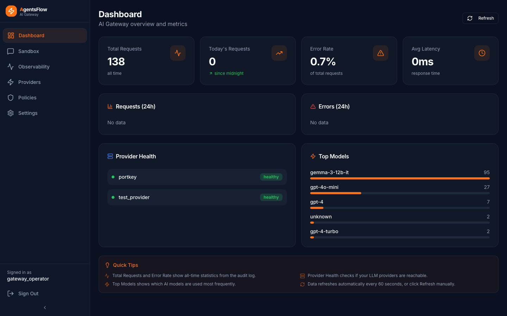
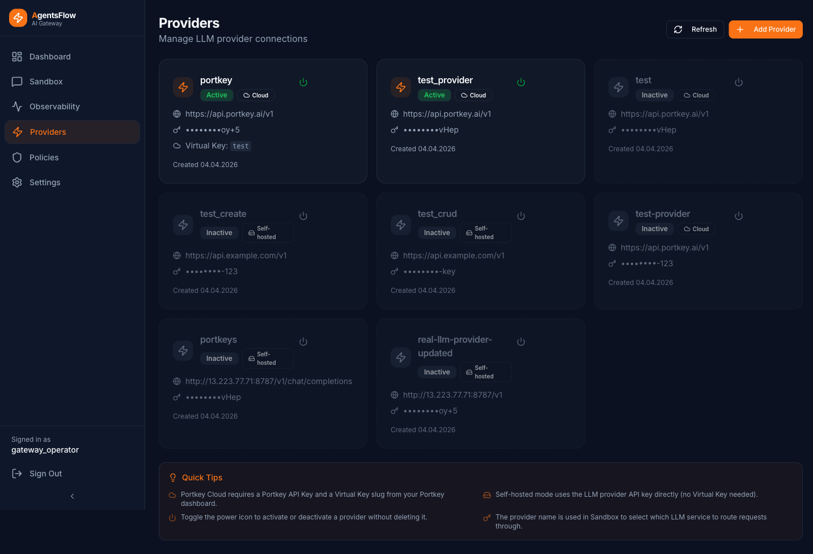
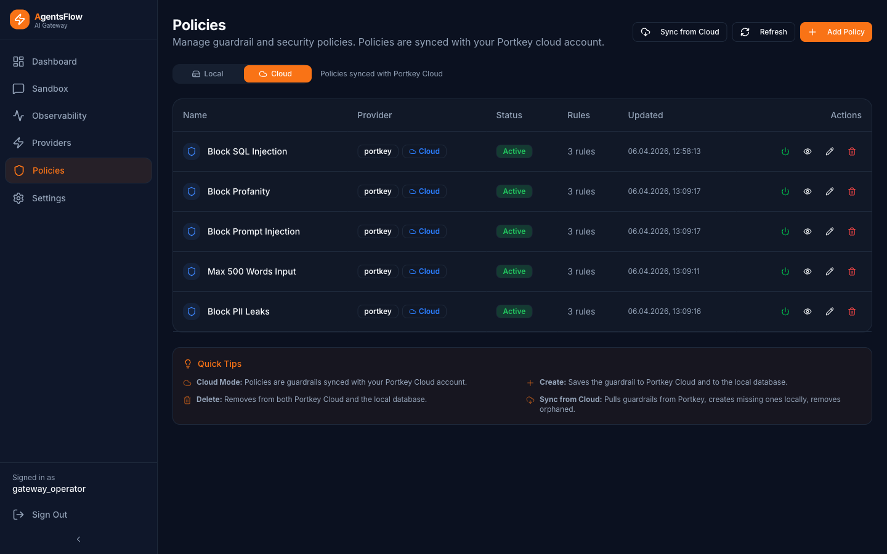
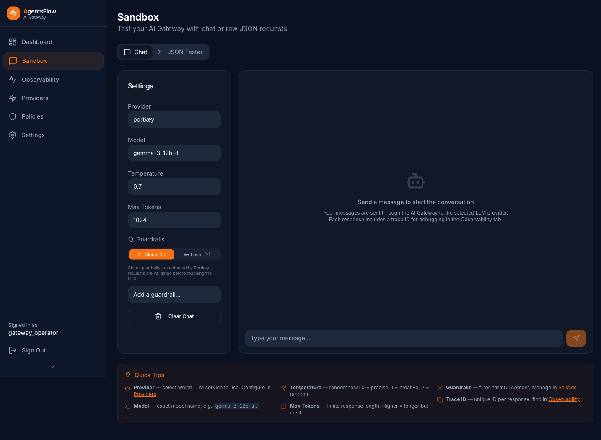
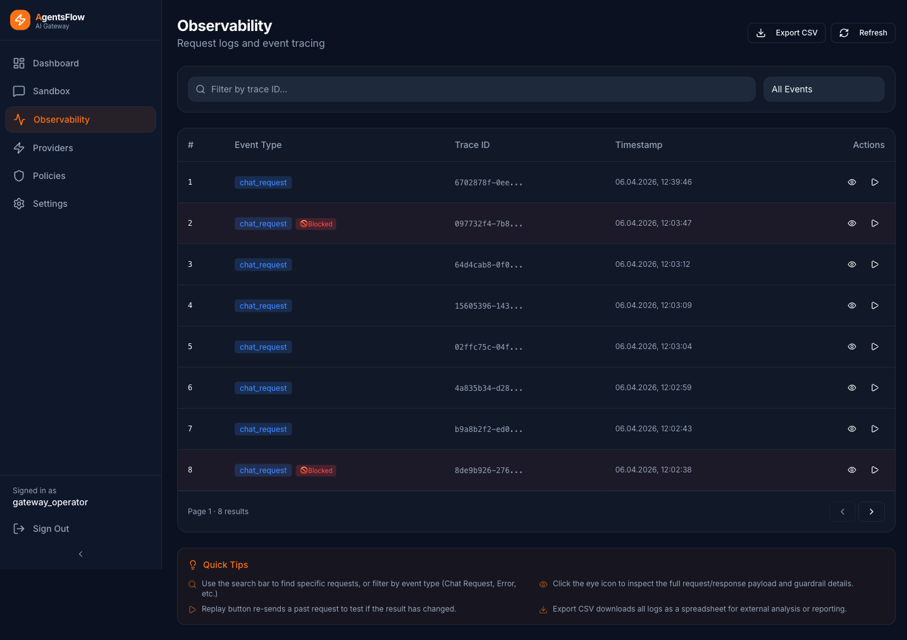
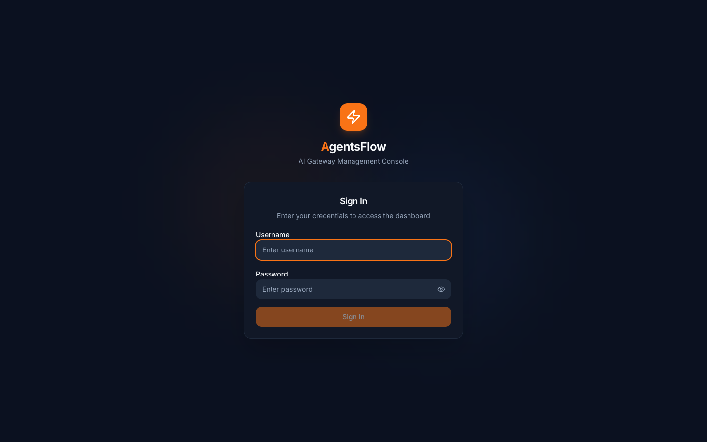

# AI Gateway

[](https://www.python.org/)
[](LICENSE)

**Async API gateway between business logic and LLM providers.**

A production-ready intelligent proxy layer between internal services and external LLM providers (via Portkey). Centralized request logging, runtime guardrail policies, encrypted credential storage, and a web admin UI. Built on Clean Architecture with full async I/O end to end.



---

## At a glance

```
~1,200 tests              unit + integration, contract-first
4      architecture       Clean Architecture, isolated layers
9      API routes         providers, policies, tester, logs, stats, settings, auth, health, webhook
0      plaintext secrets  Fernet encryption for all provider keys
100%   production-ready   AWS deployed, runbook handed over
~60s   cold start         from `docker compose up` to ready
```

---

## What it does

| Capability | Detail |
|---|---|
| **LLM proxy** | Routes requests from internal services to external providers through Portkey with virtual key support |
| **Guardrails** | Runtime policies with cloud sync, enable / disable per request, HTTP 446 blocked response |
| **Credential security** | Provider API keys encrypted at rest with Fernet, never stored in plaintext |
| **Audit and observability** | Per-request log: provider, model, latency, status, blocked-by-guardrail flag, full payloads |
| **Admin UI** | Manage providers, policies, browse logs, view aggregate statistics, sandbox tester |
| **Webhook ingress** | Signature verification via `X-Webhook-Secret` for inbound integrations |
| **Health checks** | Liveness, readiness, provider connectivity probes (every 60s) |

---

## Screenshots

### Dashboard — real-time metrics, provider health, top models


### Providers — manage LLM providers, virtual keys, cloud / self-hosted toggle



### Policies — runtime guardrails with two-way sync



### Sandbox — test prompts with policies and providers before going live



### Observability — per-request audit log with full payload inspection



### Sign in — single-user JWT auth with brute-force protection



---

## Architecture

Clean Architecture with four isolated layers. Each inner layer has zero dependency on outer layers. Tests are contract-first: every route, repository, and adapter has a colocated specification; tests reference the spec, code is written against it.

```
app/                              97 Python files · 9 routes · 39 test modules
├── domain/                       Pure entities, DTOs, contracts (zero external deps)
│   ├── entities/                 Provider, Policy, Log, Tester, Stats
│   ├── dto/                      Cross-layer data transfer objects
│   ├── contracts/                Repository and adapter interfaces (protocols)
│   └── utils/                    Pure helpers: crypto, validation, time
├── services/                     Use Cases — business logic orchestration
│   ├── provider_service          CRUD + connectivity test + Portkey sync
│   ├── policy_service            CRUD + two-way cloud sync + apply at request time
│   ├── tester_service            Sandbox: chat / completion / embedding with virtual keys
│   └── stats_service             Aggregations: requests, errors, latency, top models
├── infrastructure/               I/O implementations (only layer that touches the network)
│   ├── database/                 SQLAlchemy Async repositories, Alembic migrations
│   └── adapters/                 PortkeyAdapter (HTTP), FernetCryptoAdapter (encryption)
└── api/                          FastAPI routes, schemas, middleware, DI
    ├── routes/                   9 routers: providers, policies, tester, logs, stats,
    │                             settings, auth, webhook, health
    ├── schemas/                  Pydantic v2 request / response models
    ├── middleware/               Auth, rate limiting, request logging, CORS
    └── dependencies/             FastAPI DI wiring
```

### Why Clean Architecture here

This is a system that will outlive its initial integration. Portkey today; OpenRouter or a self-hosted gateway tomorrow. The adapter pattern means swapping the LLM-routing layer is a single-file change: implement `LLMGatewayContract`, register it in DI. The domain layer doesn't know Portkey exists.

---

## Testing

**~1,200 tests** across 39 test modules. Mix of unit (pure-domain logic), repository tests (SQLite in-memory), and integration (full HTTP stack with mock LLM responses).

### Run the suite

```bash
uv run pytest                          # full suite
uv run pytest --cov=app --cov-report=html
uv run pytest -k "provider"            # by keyword
uv run pytest app/api/routes/tests_providers/   # by path
```

### What's covered

| Layer | Approach | Files |
|---|---|---|
| **Domain entities** | Property-based on invariants (Pydantic validators, business rules) | `app/domain/entities/test_*.py` |
| **Services (use cases)** | Mock repos and adapters, focus on orchestration logic | `app/services/test_*.py` |
| **Repositories** | Real SQLite in-memory, full CRUD + edge cases (unique constraint, soft delete) | `app/infrastructure/database/test_*.py` |
| **Portkey adapter** | `respx` for httpx mocking, full response-shape coverage | `app/infrastructure/adapters/test_portkey_*.py` |
| **API routes** | TestClient with DI overrides, every endpoint with auth + payload validation | `app/api/routes/tests_*/test_*.py` |
| **Crypto** | Round-trip encryption + decryption, tampered ciphertext rejection | `app/domain/utils/test_crypto.py` |

### Contract-first methodology

Every module has a colocated `*_spec.md` describing inputs, outputs, error cases, and invariants. Tests are written against the spec **before** the implementation. The codebase ships with these specs in source — read `app/api/routes/tests_providers/SPEC.md` to see how the providers API was specified.

### Quality gates

```bash
uv run mypy --strict app               # strict type checking, zero `Any` in domain
uv run ruff check app                  # lint
uv run bandit -r app                   # security scan (SAST)
```

Pre-commit hooks block any commit that fails `mypy strict + ruff + bandit + pytest`.

---

## Performance

| Metric | Value | Notes |
|---|---|---|
| **Cold start** | <60s `docker compose up` | Backend + frontend + healthcheck |
| **Backend boot** | <2s after deps loaded | uvicorn `--workers 1`, SQLite WAL ready |
| **Request roundtrip overhead** | ~5–15ms | Gateway processing (auth, log, route) excluding upstream LLM time |
| **DB query (read)** | <1ms p95 | SQLite WAL with prepared statements |
| **Audit log write** | non-blocking | Background task, never blocks the response |
| **Concurrent connections** | 100+ on default settings | uvicorn h11 + asyncio, single worker |
| **Memory footprint** | ~80 MB resident | Backend container at idle, no leaks under load |

Async I/O end to end:

- `httpx.AsyncClient` for Portkey calls (shared session, connection pool)
- `SQLAlchemy.ext.asyncio` for all DB operations
- `aiosqlite` driver (PostgreSQL-ready: change one URL)
- No blocking calls in the request path — `BackgroundTasks` for log writes

---

## Stack

| Layer | Technology |
|---|---|
| **Backend** | Python 3.12, FastAPI, Uvicorn |
| **HTTP client** | httpx (async, shared `AsyncClient`) |
| **Database** | SQLite (WAL) for the POC, PostgreSQL-ready (asyncpg-compatible) |
| **ORM** | SQLAlchemy 2.0 Async + aiosqlite, Alembic for migrations |
| **Validation** | Pydantic v2, pydantic-settings |
| **Crypto** | `cryptography` (Fernet symmetric encryption for provider keys) |
| **Auth** | JWT (HS256) with short TTL, in-memory rate limiter, bcrypt password hashing |
| **Frontend** | Next.js 14, TypeScript, Tailwind CSS, Recharts |
| **Container** | Docker multi-stage, docker-compose for the local stack |
| **Tooling** | uv (lockfile-based deps), pytest, mypy strict, ruff, bandit, pre-commit hooks |
| **LLM gateway** | Portkey (virtual keys, guardrail configs, cloud / self-hosted) |

---

## Quick start

Requires Docker (OrbStack or Docker Desktop) and [uv](https://github.com/astral-sh/uv) for local development.

```bash
# 1. Clone and configure
git clone https://github.com/safronovlab/ai-gateway-poc.git
cd ai-gateway-poc
cp .env.example .env
# Edit .env: ADMIN_PASSWORD, WEBHOOK_SECRET (≥16 chars), ENCRYPTION_KEY (Fernet)
# Generate Fernet key: python -c "from cryptography.fernet import Fernet; print(Fernet.generate_key().decode())"

# 2. Boot the full stack
docker compose up -d --build

# 3. Open the app
open http://localhost:3000     # frontend
curl http://localhost:8000/health   # backend health
```

Sign in with the credentials you set in `.env`. The dashboard, providers, policies, sandbox, and observability pages are immediately usable.

### Local development without Docker

```bash
# Backend
uv sync
uv run alembic upgrade head
uv run uvicorn app.main:app --reload   # http://localhost:8000, OpenAPI at /docs

# Frontend
cd frontend
npm install
npm run dev                            # http://localhost:3000
```

---

## Security

| Concern | Mitigation |
|---|---|
| **Provider API key storage** | Fernet symmetric encryption at rest; key derived from a `ENCRYPTION_KEY` env variable |
| **Authentication** | JWT bearer tokens with configurable TTL, bcrypt-hashed password, brute-force protection on the auth endpoint |
| **Webhook trust** | `X-Webhook-Secret` HMAC verification for inbound webhooks |
| **CORS** | Whitelist via `CORS_ORIGINS`, wildcard rejected at config-load time |
| **Decompression bomb guard** | Pydantic models cap nested payload depth + max string lengths |
| **Static analysis** | `bandit` runs on every pre-commit |
| **Dependency scanning** | uv lockfile, pinned versions, weekly Dependabot review |

### Known limitation — rate limiter

The current brute-force rate limiter on `/auth/login` uses an in-memory `dict` per process. In multi-worker deployments (`uvicorn --workers >1`, gunicorn) each worker keeps its own counter, so an attacker can distribute attempts across workers and effectively get `5 × N_workers` tries.

For production deployments with multiple workers, swap the limiter for a Redis-backed sliding window (`fastapi-limiter` or a Lua-based implementation on `redis-py`). For single-worker deployments (the POC default and recommended Coolify / Fly.io config) the in-memory limiter is sufficient.

This limitation is documented in `app/api/middleware/rate_limit_spec.md`.

---

## Deploy

The repo ships with `deploy.sh` and `docker-entrypoint.sh` for AWS EC2 (or any Linux host with Docker). Production checklist:

1. Provision Ubuntu 24.04 with Docker installed.
2. Create `.env.production` with strong secrets (rotate `ENCRYPTION_KEY` once and store it in a secret manager).
3. Run `./deploy.sh` to build images, run migrations, restart the stack.
4. Front the API with nginx or Caddy + Let's Encrypt for TLS.
5. Wire the audit log volume to durable storage (EBS or equivalent).
6. Schedule log rotation and database backups.

A complete operational runbook is delivered on engagement handover.

---

## API surface

| Method | Path | Purpose |
|---|---|---|
| POST | `/auth/login` | Issue JWT session token |
| GET | `/auth/me` | Verify token, return user identity |
| GET | `/providers` | List configured providers |
| POST | `/providers` | Create provider (key encrypted at write) |
| PUT | `/providers/{id}` | Update provider |
| POST | `/providers/{id}/test` | Probe connectivity |
| GET | `/policies` | List guardrail policies |
| POST | `/policies` | Create policy (synced to cloud) |
| PUT | `/policies/{id}` | Update policy (cloud sync, runtime apply) |
| POST | `/sandbox/test` | Run a sandboxed LLM request through a chosen provider + policy |
| GET | `/logs` | Paginated audit log (filters: provider, model, status, blocked, date range) |
| GET | `/stats/summary` | Aggregates: totals, error rate, p50/p95/p99 latency |
| GET | `/stats/top-models` | Top-N models by request count |
| GET | `/stats/provider-health` | Last-known health per provider |
| POST | `/webhook/incoming` | HMAC-verified inbound webhook |
| GET | `/health` | Liveness probe |

Full OpenAPI spec at `http://localhost:8000/docs` when running.

---

## Author

Built by Oleg Safronov. Senior Backend, AI Integration.
Portfolio: [github.com/safronovlab](https://github.com/safronovlab)

---

## License

Showcase repository. The codebase is published for portfolio review. No external license is currently issued.
